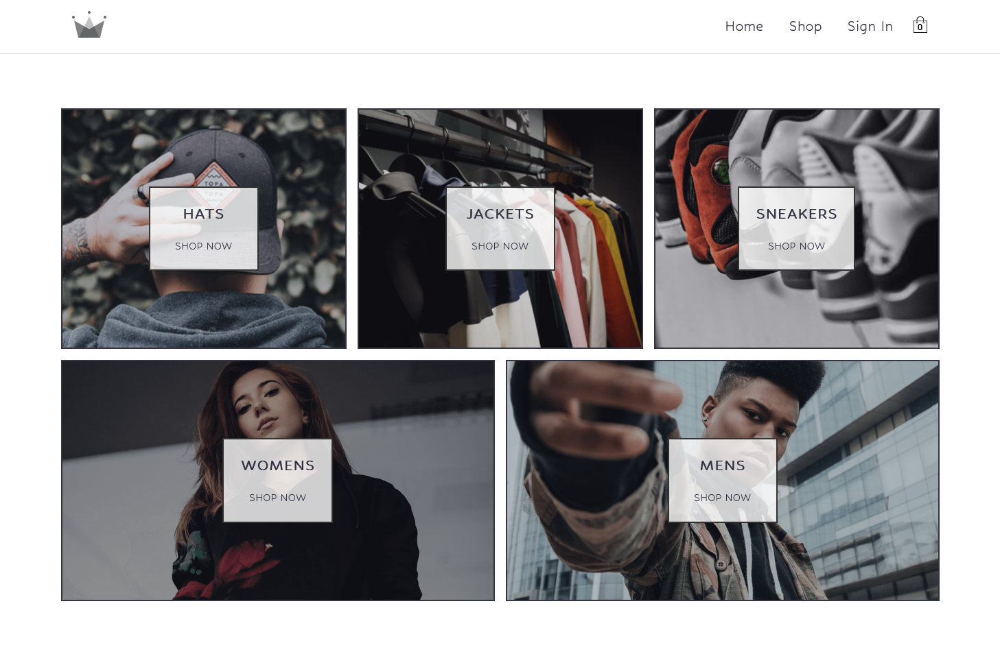

<!-- markdownlint-disable MD033 -->
<h1 align="center">Crown eCommerce</h1>

eCommerce Project from <a href="https://zerotomastery.io/courses/learn-react/">Zero to Mastery's Academy React Course.</a>

<h3 align="center">Languages</h3>

  <a href="#">English</a> • <a href="./lang/README.pt-br.md">Português</a>

<!-- markdownlint-enable MD033 -->

## Table of contents

- [Overview](#overview)
  - [About the project](#about-the-project)
  - [Links](#links)
- [My process](#my-process)
  - [Built with](#built-with)
  - [What I learned](#what-i-learned)
- [Author](#author)

## Overview

### About the project

This have been my greatest project till this moment, and I've learn plenty of things with it! I tried many new things like using Firebase as the backend/db service to serve the data to the website, as the sign in/sign up as well. It was quite a challenge to get my head around, but nonetheless with the help of ZTM's professor Yihua Zhang I could make it. Some of the new technologies I tried either with Yihua's guidance or alone includes:

- Firebase database usage
- Sign in & Sign Up with email/password
- Sign in with Google account
- Loading animation for products' page w/ AnimeJS

### Links

- Live Site URL: [Github Pages](https://crown-ecommerce.pages.dev/)

## My process

### Built with

- React
- React Router
- Firebase
- Sass
- Vite
- AnimeJS
- uuid

### What I learned

I think the most valueable knowledge I got here was the experience at working in a great project, with quite a complexity involved and multiple development phases with different aspects. When someone which only did minor and relatively simple projects, making a big project like this is really a game changing experience.

Besides that, this was my first opportunity to use and learn about Firebase, as well as improve my knowledge in Sass, have my second contact with React Router, which I learned new things like how to use the Outlet component to render the children of a Route and using AnimeJS to make a simple and neat loading animation!

## Author

- [My Website](https://amodeusr.pages.dev)
- Github - [@AmodeusR](https://github.com/amodeusr)
- Linkedin - [@AmodeusR](https://www.linkedin.com/in/AmodeusR)
