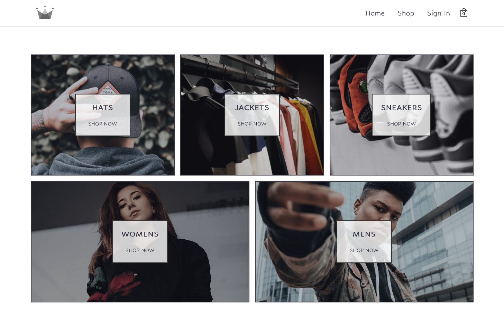

<!-- markdownlint-disable MD033 -->
<h1 align="center">Crown eCommerce</h1>

Projeto Crown eCommerce do curso <a href="https://zerotomastery.io/courses/learn-react/">React da Academia Zero to Mastery.</a>

<h3 align="center">Idiomas</h3>

  <a href="../README.md">English</a> • <a href="#">Português</a>

<!-- markdownlint-enable MD033 -->

## Índice

- [Visão Geral](#visão-geral)
  - [Sobre o projeto](#sobre-o-projeto)
  - [Links](#links)
- [Meu processo](#meu-processo)
  - [Desenvolvido com...](#desenvolvido-com)
  - [O que aprendi](#o-que-aprendi)
  - [Recursos úteis](#recursos-úteis)
- [Autor](#autor)

## Visão geral

### Sobre o projeto

Este foi o meu maior projeto até o momento, tendo aprendido muitas coisas diferentes! Eu experimentei várias novas coisas como o uso do Firebase como serviço de backend/db para servir os dados ao website, assim como as opções de entrar/registrar. Foi difícil entender todo esse novo conhecimento repentinamente, não obstante com a ajuda do professor Yihua Zhang eu pude entender. Algumas das novas tecnologias que usei seja com a ajuda do professor Yihua ou sozinho incluem:

- Uso do banco de dados do Firebase
- Entrar & registrar com email/password
- Entrar com conta Google
- Animação de carregamento nas páginas de produtos c/ AnimeJS

### Links

- URL para o Site: [Github Pages](https://crown-ecommerce.pages.dev/)

## Meu processo

### Desenvolvido com...

- React
- React Router
- Firebase
- Sass
- Vite
- AnimeJS
- uuid

### O que aprendi

Eu acredito que o conhecimento mais valioso que consegui aqui foi a experiência em trabalhar em um grande projeto, com uma certa complexidade envolvida e múltiplas fases de desenvolvimento com diferentes aspectos. Quando alguém que só fez projetos pequenos e relativamente simples, fazer um grande como este é realmente um divisor de águas.

À parte disso, esta foi a minha primeira oportunidade de usar e aprender sobre o Firebase, assim como aprimorar meus conhecimentos em Sass, ter meu segundo contato com React Router, aprendendo novas coisas como o uso do Outlet para renderizar os filhos de uma rota e o uso do AnimeJS para a criação de uma animação simples e elegante de carregamento.

### Recursos úteis

. Listar recursos

## Autor

- [Meu site](https://amodeusr.pages.dev)
- Github - [@AmodeusR](https://github.com/amodeusr)
- Linkedin - [@AmodeusR](https://www.linkedin.com/in/AmodeusR)
- Frontend Mentor - [@AmodeusR](https://www.frontendmentor.io/profile/AmodeusR)
